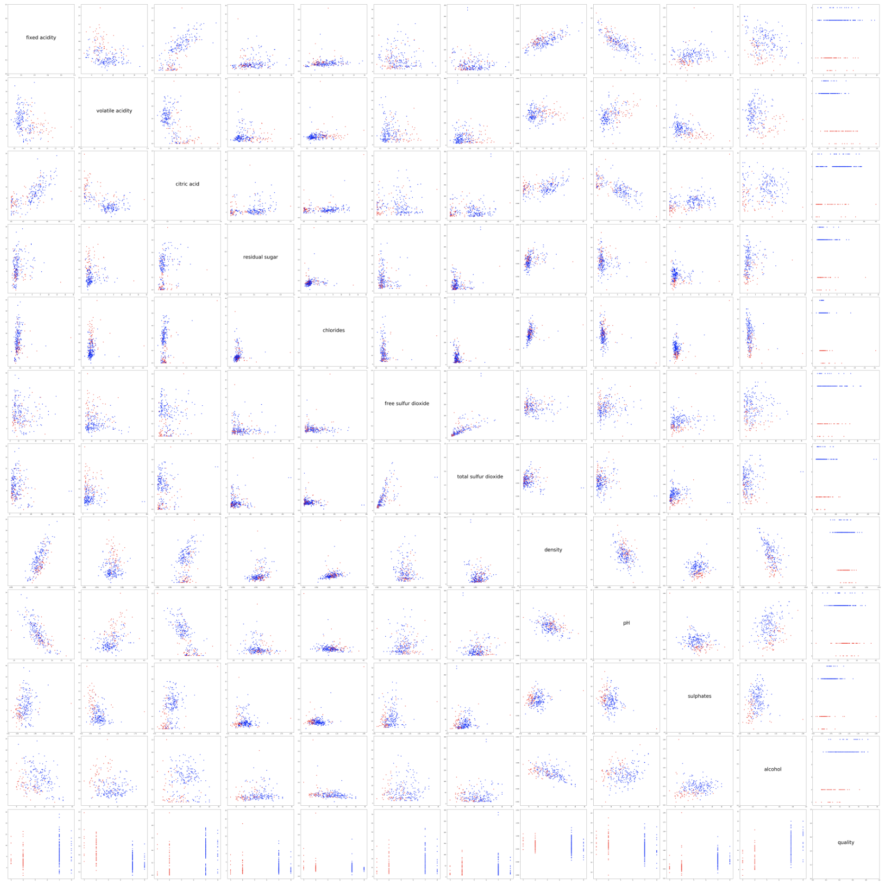
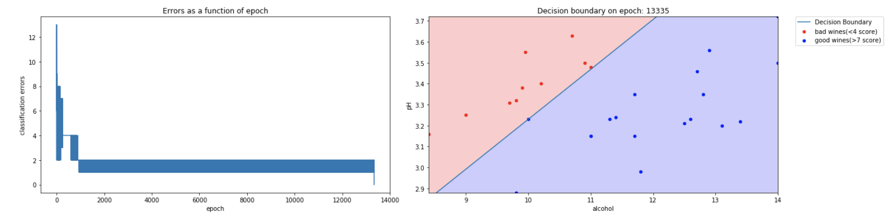
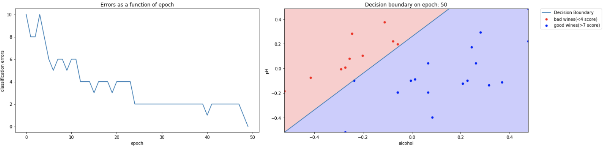
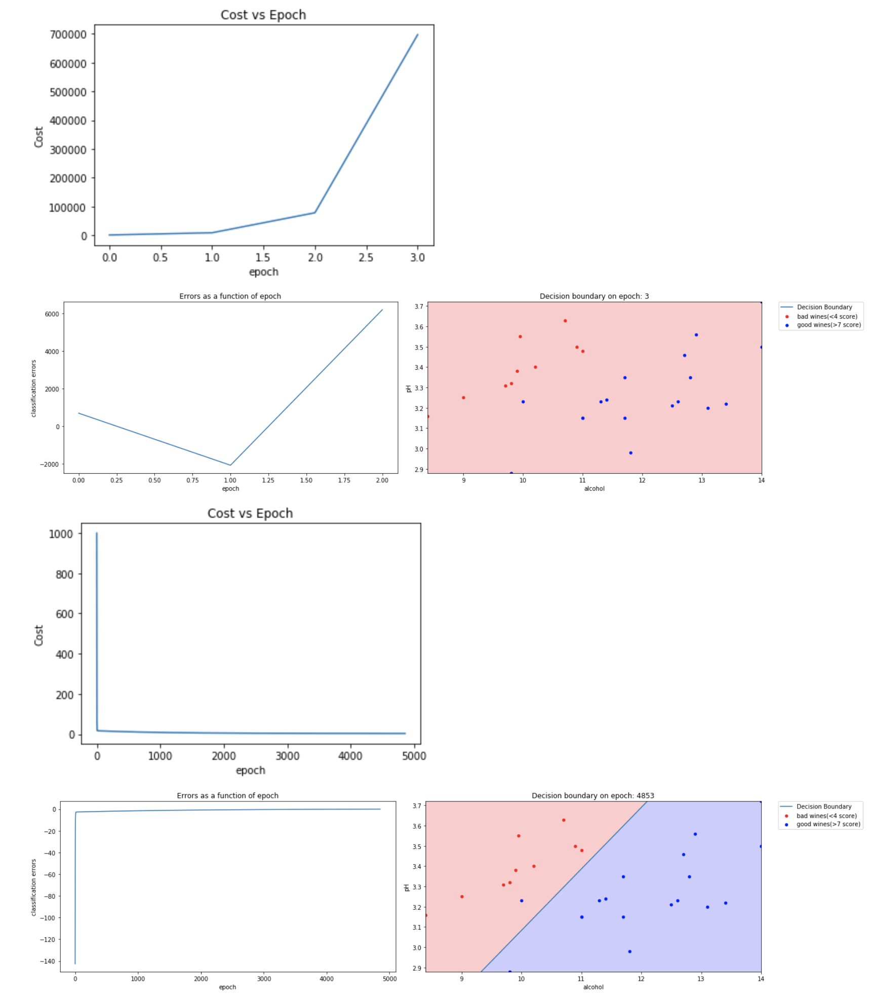
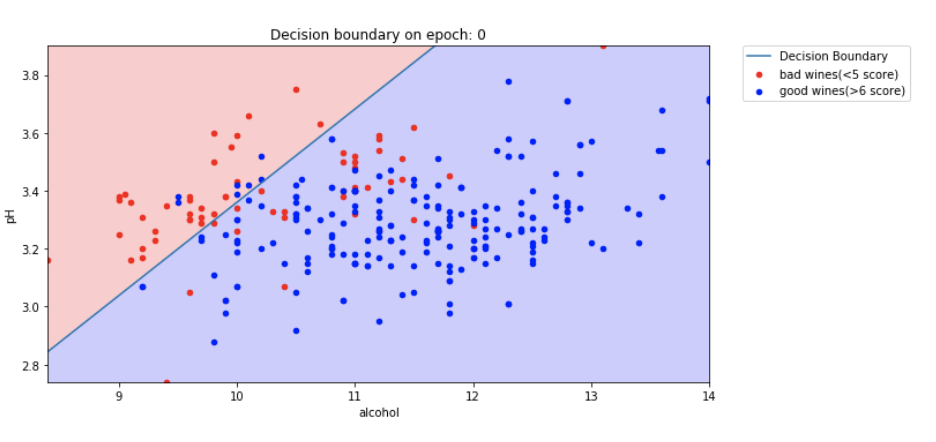

# ft_sommelier
Write a serires of simple machine learning algorithms based on single biological neurons.

## Restriction
- Matplotlib, pandas, and the standard python libraries are allowed except:
  - Pandas DataFrame math/matrix methods (i.e ‘.T’, ‘.transpose’, ‘.dot’, ‘.add’, ‘.divide’, ‘.mean’, ‘.std’, etc. . . )
- NOT allowed to directly import and use libraries like: numpy, scipy, scikitlearn, tensorflow, etc. . .

## Mandatory part
- [x] Work must be turned in as an IPython/Jupyter notebook
- [x] For each section (V.1, V.2, etc. . . ) must create a “Markdown” header cell in the notebook
- [x] Exercises you will need to address will be in the form of alphabetical list elements: “a), b), c), d), etc. . . ”
- [x] Exercises with open ended questions should be answered in a "Markdown" cell.

### Data Scatter Graph

### Perceptron
###### with Raw data

###### with Clean data

### Adaline

### k-fold Training

###### Result

